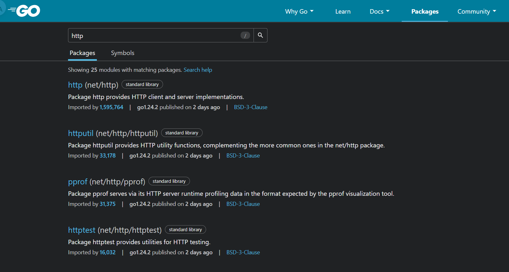

# Golang

Go o [Golang](https://go.dev/), desarrollado por Google, con un diseño y estilo simplista. Mutliples veces usado para servidores, backends, APIs, debido a su velocidad y soporte de alta concurrencia.

## Instalacion de Goalng
Para ejecutar sus archivos es necesario descargar el compilador y su paquete de herramientas
🔗 [Toolchain](https://go.dev/doc/install)


> Posteriormente puedes comprobar su instalacion en la consola con el comando ```go version``` y configurar correctamente variables de entorno.

## ⚙️ Configuración de variables de entorno
En sistemas operativos como Windows es importante establecer el PATH para Go:

* GOROOT: Directorio donde está instalado Go.
* GOPATH: Carpeta donde se almacenarán tus proyectos (por defecto: C:\Users\TuUsuario\go).
* PATH: Añadir %GOROOT%\bin y %GOPATH%\bin para poder usar go desde la terminal.


# 📁 Estructura básica de un proyecto Go
Con Go, puedes crear un proyecto desde la consola:

```go
go mod init github.com/usuario/nombre-proyecto
```

Genera esto:
```
└── 📁first-template
    └── go.mod // declara las dependencias
    └── go.sum // hashes -> registros criptográficos
    └── main.go // punto de inicio de la applicacion
```

## 📦 Gestión de dependencias (Módulos Go) - Funcionamiento básico
Go hoy en dia funciona con un sistema de módulos, que permite declarar y [resolver dependencias](https://go.dev/doc/modules/managing-dependencies).

* ``go mod tidy``: Limpia y descarga dependencias necesarias.
* ``go get`` <paquete>: Agrega una nueva dependencia.
* ``go build``: Compila la aplicación.
* ``go run main.go``: Ejecuta tu código directamente.
* ``go test``: Ejecuta pruebas.

Ejemplo:
```bash
go get github.com/gin-gonic/gin
```
Luego de ejecutar el comando y se instale la dependencia, se creara una archivo ``go.sum``, guarda un registro criptográfico de las librerias/dependencias descargadas:


El archivo go.mod almacenará la declaracion de todas las dependencias usadas


En caso tengas una proyecto con multiples dependencias, incluso muchas sin usar, puede ejecutar el comando ``go mod tidy``, ayudara a ordener las dependencias y descargarlas las necesarias, que estes usando.

Todas las dependencias se manejan desde el archivo go.mod, sin archivos XML o configuraciones adicionales.

> Es posible encontrar más dependencias en la pagina oficial de [Go Packages](https://pkg.go.dev/)



## 💡 IDEs recomendados

* [Visual Studio Code](https://code.visualstudio.com/) con la extensión oficial de Go (Altamente recomendado)
* [GoLand](https://www.jetbrains.com/es-es/go/) (Recomendado por gran cantidad de funcionalidades avanzadas, version de paga)


# Encore.go Framework Go
[Encore.go](https://encore.dev/go) es un framework para desarrollo backend en Go, diseñado para construir servicios modernos, distribuidos y escalables, con una experiencia de desarrollo simplificada y declarativa.

También existe una versión para TypeScript llamada [Encore.ts](https://encore.dev/) para quienes prefieren JavaScript/TypeScript.

## Instalacion
Puedes instalar Encore desde PowerShell como Administrador:

```bash
iwr https://encore.dev/install.ps1 | iex
```


## 📦 Crear primer proyecto con plantilla (Hello-World)

Encore provee plantillas listas para usar. Vamos a crear una aplicación de ejemplo con el clásico hello-world:

```bash
encore app create --example=hello-world
```


Genera automáticamente una estructura de proyecto y la estructura que nos proporciona la plantilla es la siguiente:

* Crea un carpeta/modulo para el controlador de ejemplo

```
└── 📁hola-mundo
    └── 📁.encore
        └── manifest.json
    └── 📁hello
        └── encore.gen.go
        └── hello_test.go
        └── hello.go
    └── .gitignore
    └── encore.app
    └── go.mod
    └── go.sum
    └── README.md
```

**./projects/hello/hello.go**
```go
// encore:api public path=/hello/:name
// Define un endpoint público con un parámetro de ruta (:name)
func World(ctx context.Context, name string) (*ResponseWorldController, error) {
    msg := "Hello, " + name + "!"
    return &ResponseWorldController{Message: msg}, nil
}

// Definición del tipo de respuesta
type ResponseWorldController struct {
    Message string
}
```
> 🔍 El comentario ``// encore:api`` indica a Encore que esta función es un endpoint REST, accesible públicamente, y cuál será su ruta.

Iniciamos la aplicacion (Development Mood):
```bash
encore run
```


Encore expone dos puertos clave para que puedas interactuar con tu aplicación:
| Puerto            | Descripción                                                                                     |
|-------------------|-------------------------------------------------------------------------------------------------|
| `localhost:4000`  | 🌍 **Puerto público de la API**: Expone los endpoints definidos como `public`. |
| `localhost:9400`  | 🧠 **Dashboard interactivo de Encore**: Interfaz visual para: <br>• Testear endpoints <br>• Ver trazabilidad y logs <br>• Visualizar servicios y arquitectura <br>• Consultar documentación generada automáticamente |


[`hola-mundo`](./hola-mundo)