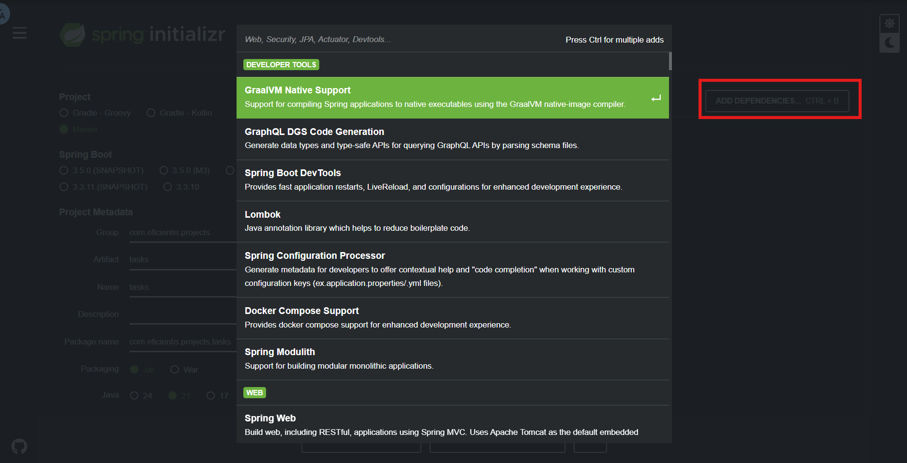

# Spring Boot con Java ☕

Inicializar un proyecto en Java puede ser tedioso debido a la gran cantidad de configuraciones y dependencias necesarias para su correcto funcionamiento. Para simplificar este proceso, existe una herramienta llamada **Spring Initializr**, que permite generar una estructura de proyecto lista para usarse, con solo unos pocos clics.

[Sitio oficial de Spring](https://spring.io/)

---

[Inicializador de Spring](https://start.spring.io/)

## 🧾 Explicación de los campos principales

- **Group**: Identificador del grupo u organización (similar al "dominio invertido", ej. `com.miempresa`)
- **Artifact**: Nombre del empaquetado o artefacto final (`.jar` o `.war`)
- **Name**: Nombre del proyecto (puede ser igual al Artifact)
- **Description**: Descripción opcional del proyecto
- **Package Name**: Se genera automáticamente combinando `group + artifact`
- **Packaging**: Formato de empaquetado (`Jar` o `War`)
- **Java**: Versión del JDK que se usará (por ejemplo, Java 17)

---

## 📦 Dependencias

Spring Initializr permite añadir dependencias del ecosistema de Java de forma sencilla.

Solo con un clic puedes agregar librerías que se integran de forma automática al proyecto.

Para el caso de nuestro proyecto, estas serían algunas de las **dependencias principales** que podríamos utilizar:

También puedes explorar más librerías y herramientas compatibles desde:

- [Maven Repository](https://mvnrepository.com/)
- [Maven Central](https://central.sonatype.com/)

---

## 🧠 IDEs recomendados

Para trabajar con Spring Boot, puedes usar:

- **Visual Studio Code**
- **IntelliJ IDEA** (Altamente recomendado por su soporte avanzado para Spring)

🔗 [Descargar IntelliJ IDEA](https://www.jetbrains.com/idea/)

Versión de paga (Ultimate):

Versión gratuita (Community):

Descarga el archivo .exe o .msi, ejecutalo y sigue las instrucciones, al final del proceso es necesario reiniciar tu equipo.
