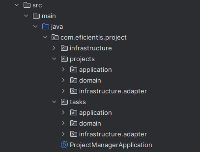
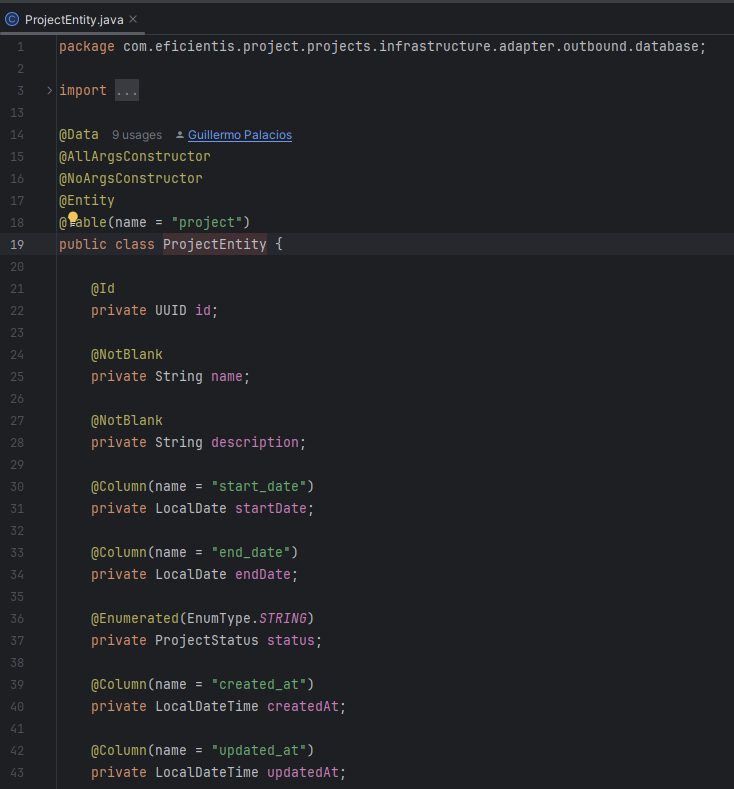

# Java
Para poder ejecutar java lo primero indispensable es descarga su kit de desarrollo, lo que ayuda a compilar los archivos .java e implenenta las herramientas y bibliotecas necesarias para el desarrollo de sus apps.

[Descargar Java JDK](https://www.oracle.com/pe/java/technologies/downloads/)


> No olvidar configurar correctamente las variables de entorno ya que puede ocasionar problemas


## Gestor de dependecias Maven (Recomendado) o Gradle
Permiten gestionar las dependencias del proyecto , compilan, testean y empacan tu app.

* [Maven](https://maven.apache.org/download.cgi), sigue siendo mas usado debido a su tiempo y cobertura
* [Gradle](https://gradle.org/install/), moderno y flexible.

# Spring Boot Framework Backend con Java ☕

Inicializar un proyecto en Java puede ser tedioso debido a la gran cantidad de configuraciones y dependencias necesarias para su correcto funcionamiento. Para simplificar este proceso, existe una herramienta llamada **Spring Initializr**, que permite generar una estructura de proyecto lista para usarse, con solo unos pocos clics.

[Sitio oficial de Spring](https://spring.io/)
[](https://spring.io/)

---

[Inicializador de Spring](https://start.spring.io/)
[](https://start.spring.io/)


## 🧾 Explicación de los campos principales

- **Group**: Identificador del grupo u organización (similar al "dominio invertido", ej. `com.miempresa`)
- **Artifact**: Nombre del empaquetado o artefacto final (`.jar` o `.war`)
- **Name**: Nombre del proyecto (puede ser igual al Artifact)
- **Description**: Descripción opcional del proyecto
- **Package Name**: Se genera automáticamente combinando `group + artifact`
- **Packaging**: Formato de empaquetado (`Jar` o `War`)
- **Java**: Versión del JDK que se usará (por ejemplo, Java 17)

---

## 📦 Dependencias

Spring Initializr permite añadir dependencias del ecosistema de Java de forma sencilla.


Solo con un clic (o enter) puedes agregar librerías que se agregan de forma automática al proyecto.


Para el caso de nuestro proyecto, estas serían algunas de las **dependencias principales** que podríamos utilizar:


También puedes explorar más librerías y herramientas compatibles desde:

- [Maven Repository](https://www.google.com/search?q=maven%20repository%20spring&sourceid=chrome&ie=UTF-8)
- [Maven Central](https://central.sonatype.com/)

---

## 🧠 IDEs recomendados

Para trabajar con Spring Boot, puedes usar:

- [**Visual Studio Code**](https://code.visualstudio.com/)
- **IntelliJ IDEA** (Recomendado por gran cantidad de funcionalidades avanzadas, version de paga)

🔗 [Descargar IntelliJ IDEA](https://www.jetbrains.com/idea/)

Versión de paga (Ultimate):


Versión gratuita (Community):


Descarga el archivo .exe o .msi, ejecutalo y sigue las instrucciones, al final del proceso es necesario reiniciar tu equipo.


---

continuando con el proyecto este se descarga en un .rar el cual debemos descomprimir y desde instellj idea importarlo como nuevo proyecto desde el path de tu proyecto


al abrir proyectos por primera vez te mostrara un anuncio de seguridad, en caso se ejecute algun script malicioso, pero al venir desde el propio inicializador de spring no debemos preocuparnos por ello, por lo que podemos confiar en su ejecucion


---

## 📂 Explorando la estructura del proyecto Spring Boot

Una vez cargado el proyecto en IntelliJ IDEA o tu IDE favorito, lo primero es **entender la estructura base** que ha sido generada.

> ⚠️ **Importante:** Asegúrate de tener instalado el **JDK 21 (LTS)** u otras.  
> De lo contrario, el IDE **no podrá compilar ni ejecutar** la aplicación correctamente.

---

### 📁 Estructura inicial de archivos (lo esencial)

```
└── 📁tasks
    └── 📁.mvn
        └── 📁wrapper
            └── maven-wrapper.properties
    └── 📁src
        └── 📁main
            └── 📁java
                └── 📁com
                    └── 📁eficientis
                        └── 📁projects
                            └── 📁tasks
                                └── TasksApplication.java
            └── 📁resources
                └── application.properties
                └── 📁static
                └── 📁templates
    └── .gitattributes
    └── .gitignore
    └── HELP.md
    └── mvnw
    └── mvnw.cmd
    └── pom.xml
```

### 🛠️ pom.xml
Este archivo contiene la configuración del proyecto en formato XML. Fue generado automáticamente por [Spring Initializr](https://start.spring.io/). Aquí se definen: 

* La versión de Spring Boot
* El grupo y artefacto del proyecto
* La versión de Java
* Las dependencias (librerías externas)
* Configuración de compilación (build)


### 📄 Estructura base del pom.xml (sin dependencias)
```xml
<?xml version="1.0" encoding="UTF-8"?>
	<modelVersion>4.0.0</modelVersion>
	<parent>
		<groupId>org.springframework.boot</groupId>
		<artifactId>spring-boot-starter-parent</artifactId>
		<version>3.4.4</version>
		<relativePath/> <!-- lookup parent from repository -->
	</parent>
	<groupId>com.eficientis.projects</groupId> <!-- name of packaging -->
	<artifactId>tasks</artifactId> <!-- name of artifact -->
	<version>0.0.1-SNAPSHOT</version> <!-- versionado -->
	<name>tasks</name> <!-- name of project -->
	<description>Demo project for Spring Boot</description>
    
    <!-- propiedades o valores globales dentro de xml -->
	<properties>
		<java.version>21</java.version> <!-- version jdk -->
	</properties>

    <!-- dependencias -->
	<dependencies>
	</dependencies>

    <!-- xd nose -->
	<build>
		<plugins>
		</plugins>
	</build>

</project>

```

### 📦 Ejemplo de dependencia en pom.xml

```xml
<dependencies>
		<dependency>
			<groupId>org.springframework.boot</groupId>
			<artifactId>spring-boot-starter-data-jpa</artifactId>
			<optional>true</optional> <!-- opcional, depende de la dependencia -->
			<scope>runtime</scope> <!-- opcional, depende de la dependencia -->
			<version>runtime</version> <!-- opcional, depende de la dependencia -->
		</dependency>
        ...
<dependencies>
```

En caso necesites una nueva dependencia tendrias que copiar el fragmento del proyecto, del proveedor de dependencias

> Spring Initializr: Algo practico seria agrega una dependencia al proyecto desde initializr entrar a la vista previa y copiar del pom.xml y pegar directamente al pom.xml de tu proyecto descargado


> Maven Repository. Aplicaria el mismo ejemplo con maven y copiarias la version más recomendada para tu proyecto


### Punto de entrada de la aplicacion

./tasks/src/main/java/com.eficientis.tasks/TaskApplicatio.java

```java
package com.eficientis.projects.tasks; // indica que ubicacion tiene en el paquete

// importaciones para los decoradores, indican desde donde provienen
import org.springframework.boot.SpringApplication;
import org.springframework.boot.autoconfigure.SpringBootApplication;

@SpringBootApplication // marca el punto de entrada de tu aplicación
public class TasksApplication {

	public static void main(String[] args) {
		SpringApplication.run(TasksApplication.class, args);
	}

}
```

> @SpringBootApplication ->  Esto permite que Spring Boot detecte todos los módulos, servicios y configuraciones necesarias para iniciar la aplicación sin configuración manual.

___

## ▶️ Ejecuvion de la aplicación
Puedes ejecutar tu aplicación de estas formas:

### 1. Desde IntelliJ IDEA
Haz clic en el botón verde ▶️ que aparece al lado de tu clase `TasksApplication.java`


### 2. Desde terminal (requiere Maven o el wrapper `mvnw`)
```bash
./mvnw spring-boot:run   # Linux/macOS
mvnw.cmd spring-boot:run # Windows
```

Puedes verificar el inicio de la aplicacion en el puerto https://localhost:8080


___

## Fuentes: 

[Guia de estructuracion DDD + Arq. Hexagonal](https://medium.com/@juannegrin/construyendo-una-restful-api-con-spring-boot-integraci%C3%B3n-de-ddd-y-arquitectura-hexagonal-af824a3a4d05) 

# 🧱 Implementación de Arquitectura Hexagonal + DDD

En este ejemplo hemos implementado una estructura basada en **Arquitectura Hexagonal (Ports & Adapters)** y **Domain-Driven Design (DDD)**, organizada en **módulos independientes** o **bounded contexts**: `subtasks` y `notifications`.

Cada módulo mantiene sus **capas independientes**:
- `domain`: lógica de negocio pura
- `application`: casos de uso
- `infrastructure`: interacción con el mundo exterior (frameworks, controladores, base de datos, etc.)

📸 Estructura del proyecto:


---

## 🎯 Caso de uso implementado

Simulamos la creación de una `Subtask` (subtarea).  
Cuando se crea, se publica un evento de dominio que el módulo `notifications` **escucha** y, como reacción, muestra por consola que la subtarea fue creada.

---

## 📦 1. Dominio: lógica del negocio

En la capa `domain` definimos:

- La **entidad `Subtask`**, que representa nuestro agregado raíz.
- La **interfaz `SubtaskRepository`**, que actúa como puerto de salida para abstraer la persistencia.

```plaintext
└── 📁domain
    └── Subtask.java
    └── SubtaskRepository.java
```


> ✅ Esta capa es completamente independiente del framework. No usamos @Entity, @Autowired, ni nada de Spring aquí.

## ⚙️ 2. Aplicación: casos de uso
En la capa application definimos los casos de uso, que son acciones que un actor del sistema puede ejecutar.
En este caso, implementamos un CRUD completo:
```
└── 📁application
    └── CreateSubtaskUseCase.java
    └── DeleteSubtaskUseCase.java
    └── GetAllSubtaskUseCase.java
    └── UpdateSubtaskUseCase.java
```


> Cada clase se encarga de orquestar una operación del negocio, sin tener conocimiento del framework ni detalles técnicos.

## 🌐 3. Infraestructura: adaptadores externos
La capa infrastructure contiene los adaptadores para interactuar con el exterior, incluyendo:

* El controlador REST (SubtaskController) con los endpoints de la API.

* La entidad persistente JPA (SubtaskEntity).

* El repositorio JPA y su implementación (JPASubtaskRepository, SubtaskRepositoryImpl).
```
└── 📁infrastructure
    └── JPASubtaskRepository.java
    └── SubtaskController.java
    └── SubtaskEntity.java
    └── SubtaskRepositoryImpl.java
```

Entidad definida:


📸 Interfaz extendida del ORM (Spring Data JPA):


📸 Implementación del repositorio (puente entre JPA y el dominio):


📸 Controlador REST:

> El controlador se encarga de recibir las peticiones HTTP y delegarlas al caso de uso correspondiente.

## 📣 Publicación y consumo de eventos (Interacción entre módulos)
Cuando una Subtask es creada, el caso de uso CreateSubtaskUseCase publica un evento de dominio:

```java
domainEventPublisher.publish(new SubtaskCreatedEvent(subtask.getId()));
```
Este evento es capturado en el módulo notifications mediante un listener:

```java
@EventListener
public void onSubtaskCreated(SubtaskCreatedEvent event) {
    // Notificación por consola
}
```

✅ Esto permite que notifications reaccione al evento sin estar acoplado a subtasks, cumpliendo con el principio de inversión de dependencias y comunicación por eventos.

___

## 🗄️ Conexión a Base de Datos (PostgreSQL)

Para que nuestra aplicación Spring Boot se comunique con una base de datos PostgreSQL, necesitamos configurar el archivo `application.properties`, ubicado en la carpeta `resources`.

📚 Recursos útiles:
- [Guía en w3resource](https://www.w3resource.com/PostgreSQL/snippets/postgresql-spring-boot.php)
- [Documentación oficial Spring Boot](https://docs.spring.io/spring-boot/docs/1.5.22.RELEASE/reference/html/boot-features-sql.html)

📂 Ubicación del archivo de configuración:
```
└── 📁main
    └── 📁java
        └── 📁com
            └── 📁eficientis
                └── 📁projects
                    └── 📁tasks
    └── 📁resources
        └── application.properties
        └── 📁static
        ├── templates
```

### ✍️ Configuración basica

En `application.properties` agregamos:

```properties
# Nombre de la aplicación
spring.application.name=tasks

# Configuración de la base de datos PostgreSQL
spring.datasource.url=jdbc:postgresql://localhost:5432/subtask
spring.datasource.username=postgres
spring.datasource.password=postgres
spring.datasource.driver-class-name=org.postgresql.Driver

# Configuración de JPA (ORM)
spring.jpa.hibernate.ddl-auto=update # También puede ser: create, validate, none
spring.jpa.show-sql=true # Muestra las sentencias SQL en consola
spring.jpa.properties.hibernate.dialect=org.hibernate.dialect.PostgreSQLDialect # lenguaje que usa la bd
```


> No olvidar crear la base de datos subtask en tu servidor PostgreSQL, y que los datos de conexión sean correctos.

___

## 🚀 Ejecución del Endpoint de Subtasks

Una vez configurada la conexión, puedes probar el endpoint principal para crear una subtarea.

* Método HTTP: POST

* URL: http://localhost:8080/api/subtasks

* Content-Type: application/json

### 📦 Body de la solciitud

> La respuesta incluye el objeto completo creado

## 🖥️ Resultado en consola
Al enviar la solicitud, verás en consola:

* Las sentencias SQL generadas por Hibernate

* La notificación del evento recibido por el listener

📸 Ejemplo del resultado en consola:


