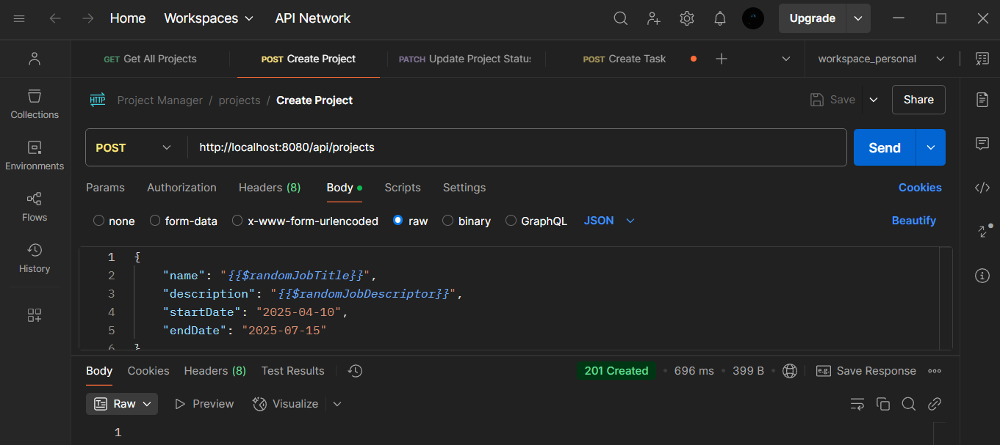
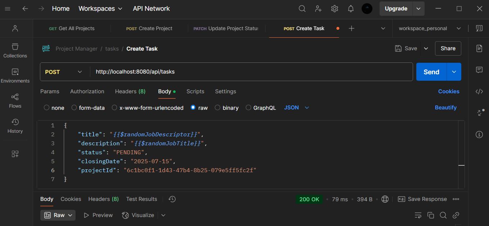

## Fuentes: 

[Guia de estructuracion DDD + Arq. Hexagonal](https://medium.com/@juannegrin/construyendo-una-restful-api-con-spring-boot-integraci%C3%B3n-de-ddd-y-arquitectura-hexagonal-af824a3a4d05) 

# 🧱 Implementación de Arquitectura Hexagonal + DDD

En este ejemplo hemos implementado una estructura basada en **Arquitectura Hexagonal (Ports & Adapters)** y **Domain-Driven Design (DDD)**, organizada en **módulos independientes** o **bounded contexts**: `subtasks` y `notifications`.

Cada módulo mantiene sus **capas independientes**:
- `domain`: lógica de negocio pura
- `application`: casos de uso
- `infrastructure`: interacción con el mundo exterior (frameworks, controladores, base de datos, etc.)

📸 Estructura del proyecto:


---

## 🎯 Caso de uso implementado

Simulamos la creación de una `Task` (tarea).  
Cuando se crea, se publica un evento de dominio que el módulo `projects` **escucha** y, como reacción, muestra por consola que la subtarea fue creada.

---

## 📦 1. Dominio: lógica del negocio

En la capa `domain` definimos:

- La **entidad `Project`**, que representa nuestro agregado raíz.
- La **interfaz `ProjectRepository`**, que actúa como puerto de salida para abstraer la persistencia.

```
└── 📁domain
    └── 📁model
        └── Project.java
        └── ProjectId.java
        └── ProjectStatus.java
    └── 📁repository
        └── ProjectRepository.java
    ├── service
```


> ✅ Esta capa es completamente independiente del framework. No usamos @Entity, @Autowired, ni nada de Spring aquí.

## ⚙️ 2. Aplicación: casos de uso
En la capa application definimos los casos de uso, que son acciones que un actor del sistema puede ejecutar.
En este caso, implementamos un la creación, el listado total y la actualización del estado del proyecto:
```
└── 📁application
    └── 📁dto
        └── 📁mapper
            └── ProjectDtoMapper.java
        └── ProjectDTO.java
    └── 📁excepcion
        └── NotFoundProjectException.java
    └── 📁ports
        └── 📁in
            └── CreateProjectUseCase.java
            └── FindAllProjectsUseCase.java
            └── UpdateProjectStatusUseCase.java
    └── 📁service
        └── CreateProjectService.java
        └── FindAllProjectsService.java
        └── UpdateProjectStatusService.java
```


> Cada clase se encarga de orquestar una operación del negocio, sin tener conocimiento del framework ni detalles técnicos.

## 🌐 3. Infraestructura: adaptadores externos
La capa infrastructure contiene los adaptadores para interactuar con el exterior, incluyendo:

* El controlador REST (ProjectController) con los endpoints de la API.

* La entidad persistente JPA (ProjectEntity).

* El repositorio JPA y su implementación (JPAProjectRepository, ProjectRepositoryImpl).
```
└── 📁infrastructure
    └── 📁adapter
        └── 📁inbound
            └── ProjectController.java
        └── 📁outbound
            └── 📁database
                └── 📁impl
                    └── ProjectRepositoryImpl.java
                └── IProjectRepository.java
                └── 📁mapper
                    └── ProjectEntityMapper.java
                └── ProjectEntity.java
```

Entidad definida:


📸 Interfaz extendida del ORM (Spring Data JPA):


📸 Implementación del repositorio (puente entre JPA y el dominio):


📸 Controlador REST:


> El controlador se encarga de recibir las peticiones HTTP y delegarlas al caso de uso correspondiente.

## 📣 Publicación y consumo de eventos (Interacción entre módulos)
Cuando una Task es creada, el caso de uso CreateTaskUseCase publica un evento de dominio:

Este evento es publicado en el contexto de nuestra aplicación:

```java
// com.eficientis.project.tasks.application.service;

@Service
@RequiredArgsConstructor
public class CreateTaskService implements CreateTaskUseCase {
    private final TaskRepository taskRepository;
    private final ApplicationEventPublisher eventPublisher;

    @Override
    public void execute(TaskDTO dto) {
        Task task = new Task(...);
        taskRepository.save(task);

        // Event Publisher
        eventPublisher.publishEvent(new TaskCreatedEvent(
                dto.getProjectId(), task.getId(), task.getTitle()
        ));
    }
}
```
```
// com.eficientis.project.tasks.infrastructure.adapter.inbound.eventListener;
@Component
public class TaskCreatedListener {

    @EventListener
    public void onTaskCreated(TaskCreatedEvent event) {
        System.out.println("NEW TASK: " + event.getTitle() + " FOR PROJECT ID: " + event.getProjectId());
    }
}

```

✅ Esto permite que la aplicacion reaccione al evento sin estar acoplado entre modulos, cumpliendo con el principio de inversión de dependencias y comunicación por eventos.

___

## 🗄️ Conexión a Base de Datos (PostgreSQL)

Para que nuestra aplicación Spring Boot se comunique con una base de datos PostgreSQL, necesitamos configurar el archivo `application.properties`, ubicado en la carpeta `resources`.

📚 Recursos útiles:
- [Guía en w3resource](https://www.w3resource.com/PostgreSQL/snippets/postgresql-spring-boot.php)
- [Documentación oficial Spring Boot](https://docs.spring.io/spring-boot/docs/1.5.22.RELEASE/reference/html/boot-features-sql.html)

📂 Ubicación del archivo de configuración:
```
└── 📁project-manager
    └── 📁src
        └── 📁main
            └── 📁java.com.eficientis
                        └── 📁project
                            └── 📁infrastructure
                            └── ProjectManagerApplication.java
                            └── 📁projects
                            └── 📁tasks
            └── 📁resources
                └── application.properties
                └── 📁static
                └── 📁templates
```

### ✍️ Configuración basica

En `application.properties` agregamos:

```properties
# Nombre de la aplicación
spring.application.name=tasks

# Configuración de la base de datos PostgreSQL
spring.datasource.url=jdbc:postgresql://localhost:5432/subprojectmanagementtask
spring.datasource.username=postgres
spring.datasource.password=postgres
spring.datasource.driver-class-name=org.postgresql.Driver

# Configuración de JPA (ORM)
spring.jpa.hibernate.ddl-auto=update # También puede ser: create, validate, none
spring.jpa.show-sql=true # Muestra las sentencias SQL en consola
spring.jpa.properties.hibernate.dialect=org.hibernate.dialect.PostgreSQLDialect # lenguaje que usa la bd
```


> No olvidar crear la base de datos subtask en tu servidor PostgreSQL, y que los datos de conexión sean correctos.

___

## 🚀 Ejecución del Endpoint de Subtasks

Una vez configurada la conexión, puedes probar el endpoint principal para crear una subtarea.

* Método HTTP: POST

* URL: http://localhost:8080/api/subtasks

* Content-Type: application/json

### 📦 Body de la solciitud



> La respuesta incluye el objeto completo creado

## 🖥️ Resultado en consola
Al enviar la solicitud, verás en consola:

* Las sentencias SQL generadas por Hibernate

* La notificación del evento recibido por el listener

📸 Ejemplo del resultado en consola:

