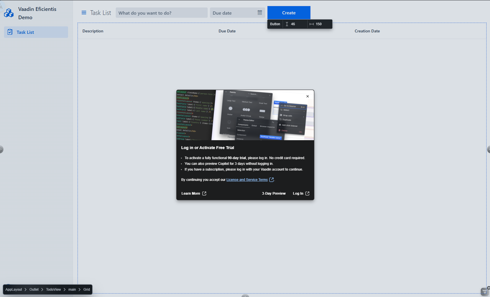

# Vaadin Eficientis Demo README

Para iniciar la aplicación en modo de desarrollo, ejecute: `./mvnw`

Para construir la aplicación en modo producción, ejecute: `./mvnw -Pproduction package`

## Inicio

La [guía](https://vaadin.com/docs/latest/getting-started) permitirá que comprenda rápidamente su nueva aplicación Vaadin Eficientis Demo. Poder configurar su entorno de desarrollo, a entender la estructura del proyecto y a encontrar recursos que le ayudarán a transformar el esqueleto del proyecto.

## Copilot Integrated

